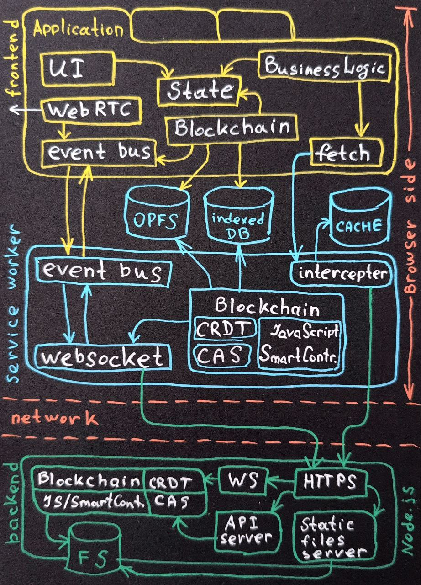

# 🌍 Global storage

These technologies together form the infrastructure for local-first applications.

- [metarhia/globalstorage](https://github.com/metarhia/globalstorage)

## PWA (Progressive Web App)

Web apps with UX close to native: offline mode, installation, fast loading. PWAs help when connectivity is poor or networks are slow by combining strengths of web and native platforms.

- [HowProgrammingWorks/PWA](https://github.com/HowProgrammingWorks/PWA)

## CRDT (Conflict-Free Replicated Data Types)

Data structures that enable automatic conflict resolution in distributed systems. CRDTs simplify synchronization and concurrent editing, enabling offline-first applications without data loss or conflicts.

## CAS Containers (Compare-And-Swap)

An atomic concurrency mechanism that stores records protected by hashes or versions. CAS containers help avoid race conditions and concurrent modification conflicts, ensuring data consistency and enabling optimistic concurrency control.

- [HowProgrammingWorks/CAS](https://github.com/HowProgrammingWorks/CAS)

## IndexedDB (browser built-in database)

Client-side database API for transactional storage of structured data in browsers. IndexedDB provides offline persistence, local querying, caching, and support for building b-tree indexes.

- [HowProgrammingWorks/indexedDB](https://github.com/HowProgrammingWorks/indexedDB)
- [metarhia/indexeddb-client](https://github.com/metarhia/indexeddb-client)

## OPFS (Origin Private File System)

Secure, high-performance file system accessible only by web applications within their origin. OPFS is suited for large file storage and high-speed file operations in the browser.

- [HowProgrammingWorks/OPFS](https://github.com/HowProgrammingWorks/OPFS)

## Blockchain (without mining)

Distributed ledger providing immutable history and strong integrity guarantees. Used for decentralized databases where immutability, transparency, and trust are required.

- [HowProgrammingWorks/Blockchain](https://github.com/HowProgrammingWorks/Blockchain)

## JavaScript Smart Contracts

Business logic executed in JavaScript within decentralized environments. Solves automation and trust issues related to data changes, ensures automatic enforcement of agreements, and secure code execution.

- [HowProgrammingWorks/UUID](https://github.com/HowProgrammingWorks/UUID)

## WebSocket

Protocol for real-time, two-way data exchange over a single TCP connection. WebSocket reduces latency and enables interactive near-real-time applications.

- [HowProgrammingWorks/WebsocketChat](https://github.com/HowProgrammingWorks/WebsocketChat)
- [metarhia/metacom](https://github.com/metarhia/metacom)

## WebRTC (Web Real-Time Communication)

Protocol for real-time streaming of multimedia and peer-to-peer data exchange. WebRTC Solves issues of direct real-time communication, low latency, and decentralization without intermediary servers.

- [HowProgrammingWorks/WebRTC](https://github.com/HowProgrammingWorks/WebRTC)

## Metaschema

Declarative schema language for modeling, validation, and data synchronization. Metaschema addresses data inconsistency, schema evolution and migration, and simplifies metadata definition.

- [metarhia/metaschema](https://github.com/metarhia/metaschema)

## Related repositories

- [metarhia/impress](https://github.com/metarhia/impress)
- [metarhia/metautil](https://github.com/metarhia/metautil)
